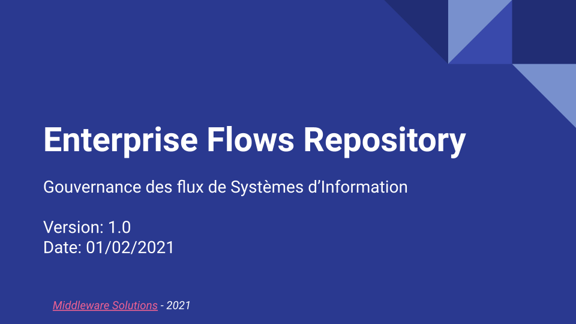

# Bienvenue sur Enterprise Flows Repository 

Ce projet est un outils de *gouvernance des flux* des systèmes d'informations.
Cet outil est :

1. Une centralisation des traces de flux / de transport des données
2. Une exploitation par point de vue de ces traces:

    * Utilisateur d'application,
    * Responsable fonctionnel / d'une ou plusieurs applications,
    * Equipe support de flux,
    * Directeur de Systèmes d'Information,
    * Architecte / Urbaniste.

Il a pour vocation de:

* offrir une vision fonctionnelle aux échanges entre applications,
* faciliter le support technique d'intermédiation applicatif,
* alerter les utilisateurs concernés,
* réinjecter des messages dans les flux,
* référencer les flux d'informations,
* proposer des rapports de gouvernance. 

# En quoi Enterpise Flows Repository est-il utile ? 

Dans les Systèmes d'Information modernes, les échanges d'information sont nombreux, pris en charge par des solutions de transports divers et qui fonctionnent à des rythmes différents.

## Pour les utilisateurs d'applications

Enterprise Flows Repository apporte l'information jusqu'aux utilisateurs d'applications métier en:

* Alertant les utilisateurs d'un dysfonctionnement,
* Leur offrant la possibilité de réinjecter un flux (fichier ou message).

## Pour les responsables et experts d'applications

Enterprise Flows Repository facilite la gouvernance fonctionnelle par :

* Un suivi *simple* des échanges entre son application et les autres,
* Une définition fine des alertes à remonter,
* Des alertes remontées rapidement,
* Une visibilité sur le périmètre de chacun (1 ou plusieurs applications, un domaine métier, etc.),
* Des actions de rejeu en masse,
* Une exposition de la qualité de service des échanges,
* La gestion du suivi pour des environnements dédiés comme pour la Recette applicative.

## Pour les Equipes support des flux

Enterprise Flows Repository facilite la vie aux équipes de support en:

* Suivant les échanges de manière transversale et complète
* Mettant en évidence les alertes de flux,
* Proposant des rapports sur étagère, 
* Permattant un filtrage avancé,
* Un lien direct entre les alertes et la documentation,
* Une description progressive :

  * des échanges 
  * puis des flux 
  * puis des médiations  

## Pour les Directeurs des Systèmes d'Information

Enterprise Flows Repository garantie la cohérence du RUN avec la vision du Système d'Information avec:

* La liste exhaustive des échanges et des flux 
* Des rapports sur étagères de synthèse de SLA,
* Documenter les éléments du système d’Information,

## Pour les Architectes

Enterprise Flows Repository porte une vision cohérente et pertinente du Système d'Information pour:

* Localiser un flux dans le SI, 
* Abstraire la complexité,
* Urbaniser le SI.

# Présentation de ce projet

[Présentation Google Slide](https://docs.google.com/presentation/d/e/2PACX-1vS_1_hXs894zFolUlVyTW0zp7bmqPMB2sAclvrAvIbG83nCy3QwozIrC5Rmb-XLvapqBdwS6ZLhSIdz/pub?start=false&loop=false&delayms=3000)

# Comment participer ?

Plusieurs types de participations s'offrent à vous:

1. Utiliser le produit et en faire un feed-back.
Une partie "REX Utilisateurs" dans la documentation vous permet d'ajouter une page ! :-O

2. Remonter les anomalies à l'équipe projet pour quelles soient prises en compte dès que possible.
Les anomalies sont gérées sur [JIRA](https://enterpriseflowsrepository.atlassian.net/browse/ISSUES).

*PS: Attention, les demandes de changement ne sont pas portées par GitHub*

# Espaces documentaires

Tous les espaces documentaires sont listés sur [Confluence](https://enterpriseflowsrepository.atlassian.net/wiki/spaces/WELCOME/overview).

# Supporter ou Sponsoriser son développement

Pour apporter votre soutient financier à l'équipe ainsi que les très nombreux contributeurs, contacter l'équipe [Middleware Editions](mailto:contact@enterpriseflowsrepository.org).

# Pas le temps d'installer l'application ?

[Middleware Editions](https://www.middleware-editions.fr) vous propose une offre cloud ADAPTEE et ISOLEE.
